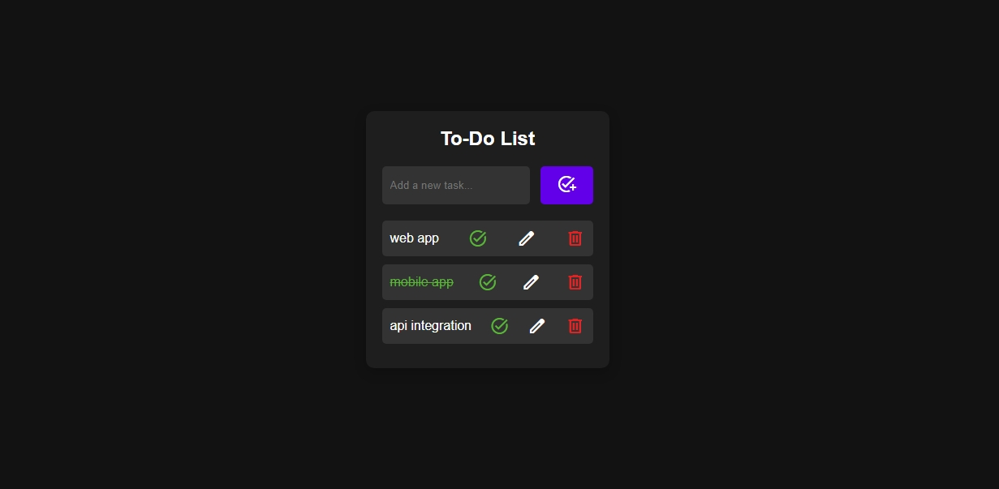
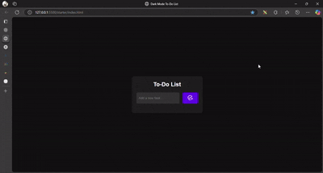

**# 📝 Dark Mode To-Do List**

A sleek, dark-themed to-do list web app built using **HTML**, **CSS**, and **JavaScript**. It allows users to add, complete, edit, and delete tasks—with all your data saved directly in your browser using **localStorage**.

---

**## 🚀 Features**

- ✍️ Add new tasks  
- ✅ Mark tasks as completed  
- 📝 Edit existing tasks  
- 🗑️ Delete tasks  
- 💾 **Persistent local storage** to retain tasks even after a browser refresh  
- 🌙 Fully dark-mode UI  
- 🎨 Material symbols for visual flair  

---

**## 📸 Preview**

 <!-- Add screenshot link if available -->

---

**## 🛠️ Tech Stack**

- 🧱 **HTML5** – Semantic structure  
- 🎨 **CSS3** – Dark theme and responsive styling  
- ⚙️ **JavaScript (ES6)** – Interactive logic  
- 🧰 **localStorage** – Used to store tasks in-browser for persistence  
- 🔤 **Google Fonts (Material Symbols)** – Clean, modern action icons  

---

---

**## 📸 Demo**

 <!-- Add screenshot link if available -->

---


**## 📂 File Structure**

```
.
├── index.html       # Main HTML page
├── style.css        # Styling with dark mode
└── script.js        # Functionality and logic (with localStorage)
```

---

**## 🨠 How It Works**

1. Enter a task and press ➕ or hit `Enter`.  
2. The task is added to a list with:  
   - ✅ Complete  
   - ✏️ Edit  
   - 🗑️ Delete  
3. All tasks are stored in **localStorage**, ensuring they're preserved between sessions.

---

**## 💡 Keyboard Shortcuts**

- Press `Enter` to quickly add a task  

---

**## 📦 Getting Started**

To run the project locally:

1. Clone the repository or download the files.  
2. Open `index.html` in your favorite web browser.

---

**## 📌 To Do / Enhancements**

- [ ] 🌗 Light/dark theme toggle  
- [ ] 📦 Drag-and-drop reordering  
- [ ] 📅 Due dates and reminders  
- [ ] 🔍 Search/filter functionality  

---

**## 📄 License**

This project is open source and free to use.

   ## Author
Developed with ❤️ by KISHAN SHARMA
linkedin : https://www.linkedin.com/in/kishanshr/
